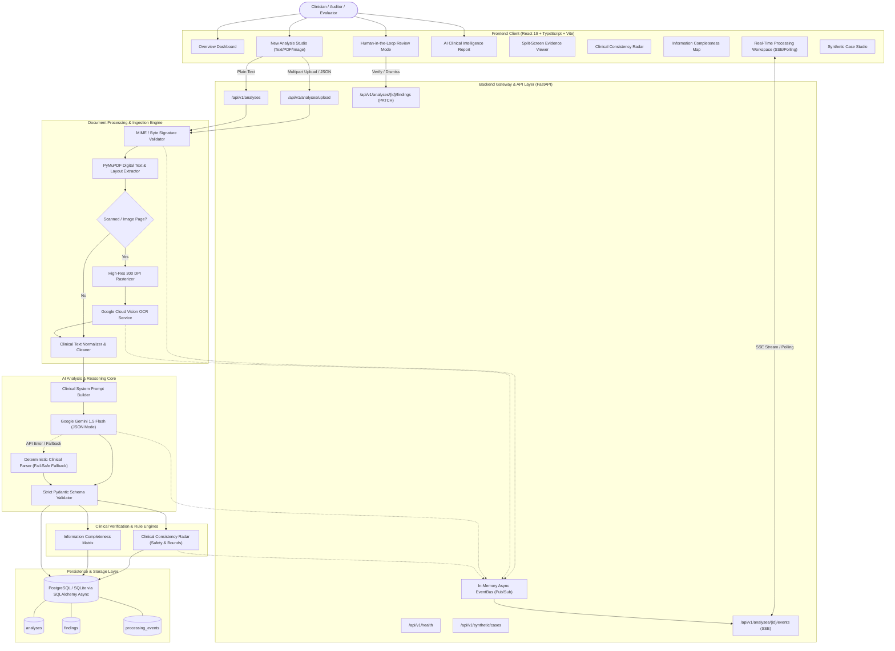

# ClinixLens — System Architecture & Data Flow

> **ClinixLens**: "From Clinical Documents to Clear, Evidence-Linked Insight."

---

## 1. System Topology & End-to-End Flow Diagram



---

## 2. Component Breakdown

### 2.1 React 19 Frontend
- **Design System**: Tailored Medical SaaS design system with slate/indigo/teal visual hierarchy, subtle glassmorphic headers, crisp typography, and high-contrast clinical badges.
- **State & Data Synchronization**: TanStack Query handles server caching, background revalidation, and optimistic updates for human verification badges.
- **Real-Time Client**: Dual-mode stream listener (Server-Sent Events with automated fallback to 1-second interval polling).
- **Split-Screen Evidence Linking**: Bidirectional selection linking extracted structured findings (e.g. `Metformin 1000 mg BID`) to source document character spans and page numbers.

### 2.2 FastAPI Backend
- **Asynchronous Execution**: Native async/await throughout all I/O pathways prevents thread exhaustion during long-running OCR or LLM API calls.
- **Background Tasks**: Document processing pipelines run asynchronously in background tasks, instantly returning a unique `analysis_id` so the frontend can immediately mount the Live Processing Timeline.
- **Decoupled Architecture**: Clean separation into `core/`, `api/`, `models/`, `schemas/`, and `services/` ensures high maintainability and testability.

### 2.3 Document Processing Layer
- **PyMuPDF (`fitz`)**: Directly extracts text, bounding coordinates, and font metadata from vector PDFs in under 50ms per page.
- **Scanned Page Detection**: Inspects glyph presence; triggers high-resolution rasterization ($300\text{ DPI}$, RGB) only when pages contain bitmap data without embedded fonts.
- **Google Cloud Vision OCR**: Sends base64-encoded page buffers to Google Vision's `DOCUMENT_TEXT_DETECTION` endpoint, recovering dense multi-column tabular text and cursive provider handwriting.

### 2.4 AI Intelligence & Pydantic Validation
- **Model**: Google Gemini 1.5 Flash configured with low temperature ($0.1$) and response schema enforcement.
- **Pydantic Validation**: Converts untrusted LLM JSON output into strictly typed Python instances (`StructuredClinicalReport`). If validation fails, defensive healing logic repairs malformed fragments or invokes the rule-based clinical engine.

### 2.5 Consistency Radar & Missing Information Map
- **Consistency Radar**: A dedicated rule engine that evaluates clinical logic independently of the LLM:
  - Allergy vs. prescription contraindication checks (e.g., Penicillin allergy vs. Amoxicillin prescription).
  - Orthostatic and extreme vital sign bounds checking.
  - Conflicting demographic attributes across document sections.
- **Information Completeness Map**: Analyzes the presence of cardinal clinical components (Demographics, Vitals, Symptoms, Diagnoses, Medications, Allergies, Plan) and computes an objective completeness score.

### 2.6 Persistence Layer
- **PostgreSQL**: Production relational store on Render or Railway using async connection pooling (`asyncpg`).
- **SQLite Fallback**: Local zero-configuration database (`aiosqlite`) for instant onboarding and automated CI/CD test runs.
- **Audit Trails**: Every human verification action (`verify`, `needs_review`, `dismiss`) persists the reviewer handle, timestamp, and updated progress metrics.

---

## 3. Real-Time Streaming Architecture

```
[Browser Client]               [FastAPI Endpoint]            [EventBus]            [Pipeline Task]
       │                               │                          │                       │
       ├─── GET /analyses/{id}/events ─►                          │                       │
       │    (Accept: text/event-stream)│                          │                       │
       │                               ├───── Subscribe(id) ──────►                       │
       │                               │                          │                       │
       │                               │                          │◄── Record Event ──────┤
       │                               │                          │    (stage: OCR)       │
       │◄── data: {"stage": "ocr"} ────┤◄──── Receive Event ──────┤                       │
       │                               │                          │                       │
       │                               │                          │◄── Record Event ──────┤
       │                               │                          │    (stage: AI Review) │
       │◄── data: {"stage": "ai_rev"} ─┤◄──── Receive Event ──────┤                       │
       │                               │                          │                       │
       │                               │                          │◄── Record Event ──────┤
       │                               │                          │    (stage: Completed) │
       │◄── data: {"stage": "done"} ───┤◄──── Receive Event ──────┤                       │
       │                               │                          │                       │
       └─── Close EventSource ─────────┴───── Unsubscribe ────────►                       │
```

---

## 4. Production Deployment Architecture

```
┌─────────────────────────────────┐       ┌─────────────────────────────────┐
│         Vercel (Edge)           │       │          Render (Cloud)         │
│                                 │       │                                 │
│  React 19 SPA (Vite Static)     │ HTTPS │  FastAPI Python 3.11 Container  │
│  Global CDN Distribution        ├──────►│  Uvicorn Multi-Worker Service   │
│  Custom Domain & SSL            │       │  Environment Variable Secrets   │
└─────────────────────────────────┘       └────────────────┬────────────────┘
                                                           │
                                                           │ Internal Network
                                                           ▼
                                          ┌─────────────────────────────────┐
                                          │      Managed PostgreSQL DB      │
                                          │                                 │
                                          │  Render Managed Database Engine │
                                          │  Encrypted Storage at Rest      │
                                          │  Automated Backups              │
                                          └─────────────────────────────────┘
```
